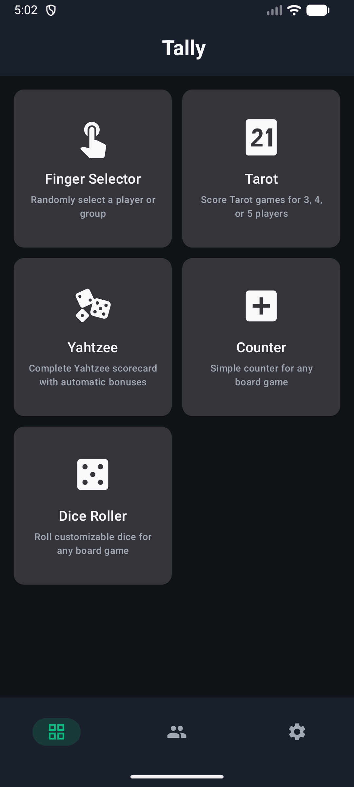
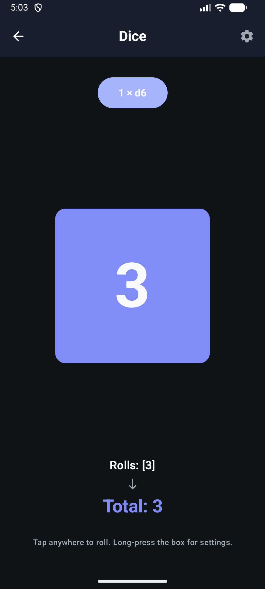
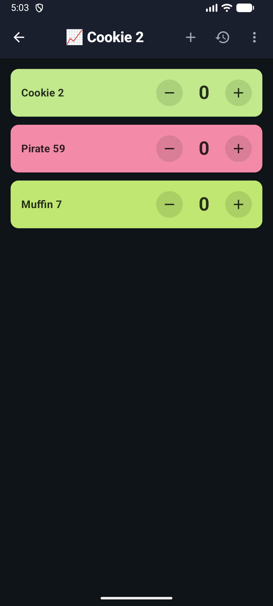
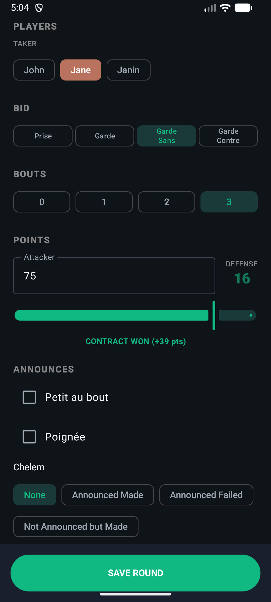
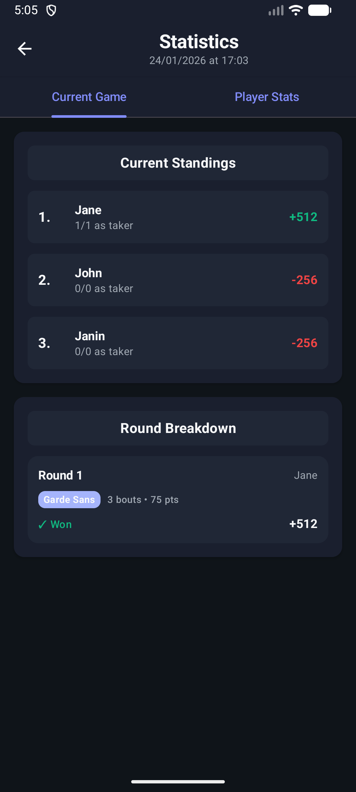
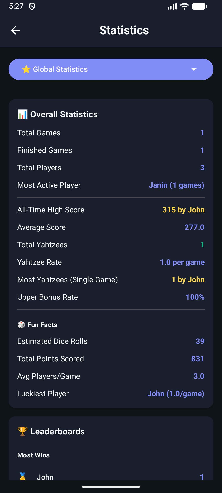

# Tally 🎲

> Your all-in-one companion for board game nights

[]()
[](LICENSE)
[]()
[]()

[](https://github.com/m0nkeysan/tally/releases/latest)
[](https://m0nkeysan.github.io/tally/)

Tally is a Kotlin Multiplatform application that brings together essential tools for game nights: scoring systems for popular games, dice rolling, player selection, and more. Built with Compose Multiplatform for a native experience on Android, iOS, and Web (WASM).

---

## 📸 Screenshots

<p align="center">
  
  
  
</p>

<p align="center">
  
  
  
</p>

---

## ✨ Features

### 🎯 Game Scoring Tools
- **Yahtzee Scoring** - Full digital scorecard with automatic bonus calculation and upper section tracking
- **Tarot Scoring** - Score French Tarot games for 3-5 players with round-by-round tracking
- **Counter** - Universal counter with history for any board game that needs score tracking

### 🎲 Game Utilities
- **Dice Roller** - Roll 1-5 dice with physics simulation and shake-to-roll support (iOS/Android)
- **Finger Selector** - Random player selection using multi-touch detection for fair turn order

### 👥 Player Management
- Save and organize your regular gaming group
- Assign colors to players for easy identification
- Quick player selection when starting new games
- Track player statistics across games

### 🎨 User Experience
- **Material Design 3** - Modern, clean interface following Material Design guidelines
- **Dark Mode** - Automatic theme switching based on system preference
- **Multi-language** - Full support for English and French
- **Offline-First** - All data stored locally with SQLDelight database, no internet required
- **Modern Tech Stack** - Kotlin Multiplatform, Compose Multiplatform, Coroutines, and SQLDelight
- **Beautiful UI** - Material 3 design with dark mode support
- **Cross-Platform** - Runs on Android, iOS, and Web (WASM)

## 🛠 Tech Stack

Tally is built with modern technologies and follows best practices for Kotlin Multiplatform development:

### Core Technologies
- **[Kotlin Multiplatform (KMP)](https://kotlinlang.org/docs/multiplatform.html)** - Share business logic across platforms
- **[Compose Multiplatform](https://www.jetbrains.com/compose-multiplatform/)** - Declarative UI framework for Android, iOS, and Web
- **[Material Design 3](https://m3.material.io/)** - Latest Material Design components and theming

### Architecture & Data
- **[SQLDelight](https://cashapp.github.io/sqldelight/)** - Multiplatform local data persistence with SQLite
- **[Koin](https://insert-koin.io/)** - Dependency injection framework
- **[Kotlin Coroutines](https://kotlinlang.org/docs/coroutines-overview.html)** - Asynchronous programming
- **[Kotlin Serialization](https://kotlinlang.org/docs/serialization.html)** - Data serialization

### UI & Navigation
- **[Navigation Compose](https://developer.android.com/jetpack/compose/navigation)** - Type-safe navigation
- **[Lifecycle ViewModel](https://developer.android.com/topic/libraries/architecture/viewmodel)** - UI state management
- **[Compose Resources](https://www.jetbrains.com/help/kotlin-multiplatform-dev/compose-images-resources.html)** - Multiplatform resource management

---

## 🏗 Architecture

Tally follows **Clean Architecture** principles with clear separation of concerns:

```
📱 UI Layer (Compose Multiplatform)
   └─ Screens, Components, ViewModels
      ↓
🎯 Domain Layer
   └─ Models, Repository Interfaces, Business Logic Engines
      ↓
💾 Data Layer
   └─ SQLDelight Database, Shared Repository Implementations
      ↓
⚙️ Platform Layer
   └─ Driver initialization & Platform specific integrations
```

### Architecture Patterns
- **MVVM (Model-View-ViewModel)** - Separation of UI and business logic
- **Repository Pattern** - Abstract data sources from business logic
- **Single Source of Truth** - SQLDelight database as the single source of truth across all platforms (Android, iOS, and Web via LocalStorage)
- **Unidirectional Data Flow** - Predictable state management with ViewModels

### Key Components
- **Scoring Engines** - Game-specific logic for Yahtzee and Tarot scoring
- **Platform Abstractions** - `expect`/`actual` for platform-specific features
- **Shared ViewModels** - Business logic shared across platforms
- **Compose UI** - 100% shared UI code between Android and iOS

---

## 🚀 Getting Started

### Prerequisites

Before building Tally, ensure you have the following installed:

- **Android Studio:** Ladybug 2024.2.1 or newer ([Download](https://developer.android.com/studio))
- **JDK:** 17 or higher ([Download](https://adoptium.net/))
- **Kotlin:** 2.3.0+ (bundled with Android Studio)
- **Gradle:** 8.14+ (included via Gradle wrapper)
- **Xcode:** 15.0+ (macOS only, for iOS development) ([Download](https://developer.apple.com/xcode/))

### Installation

#### 1. Clone the Repository
```bash
git clone https://github.com/yourusername/tally.git
cd tally
```

#### 2. Open in Android Studio
1. Launch Android Studio
2. Select **File** → **Open**
3. Navigate to the cloned `tally` directory
4. Click **OK** and wait for Gradle sync to complete

#### 3. Sync Dependencies
Android Studio will automatically sync Gradle dependencies. If not, click the **Sync Project with Gradle Files** button in the toolbar.

---

### Running on Android

#### Using Android Studio (Recommended)
1. Select an Android device or emulator from the device dropdown
2. Click the **Run** button (green play icon) or press `Shift + F10`
3. The app will build and install on the selected device

#### Using Command Line
```bash
# Build and install debug APK
./gradlew :composeApp:installDebug

# Or run directly on connected device
./gradlew :composeApp:assembleDebug
adb install composeApp/build/outputs/apk/debug/composeApp-debug.apk
```

---

### Running on iOS (macOS Only)

#### Using Xcode (Recommended)
1. Build the Kotlin framework:
   ```bash
   ./gradlew :composeApp:linkDebugFrameworkIosSimulatorArm64
   ```

2. Open the iOS project in Xcode:
   ```bash
   open iosApp/iosApp.xcodeproj
   ```

3. Select an iOS simulator or device from the scheme dropdown
4. Click the **Run** button or press `Cmd + R`

#### Using Command Line
```bash
# Build for iOS Simulator (Apple Silicon)
./gradlew :composeApp:linkDebugFrameworkIosSimulatorArm64

# Build for physical iOS device
./gradlew :composeApp:linkDebugFrameworkIosArm64
```

---

### Running on Web (WASM)

#### Try it Online
The application is automatically deployed and hosted at:
👉 **[m0nkeysan.github.io/tally/](https://m0nkeysan.github.io/tally/)**

#### Running Locally
```bash
./gradlew wasmJsBrowserDevelopmentRun
```
This will start a local development server with hot reload enabled at `http://localhost:8080`.

---

### Building for Release

#### Android Release Build
```bash
# Generate release APK
./gradlew :composeApp:assembleRelease

# Generate Android App Bundle (for Play Store)
./gradlew :composeApp:bundleRelease
```

#### iOS Release Build
1. Open `iosApp/iosApp.xcodeproj` in Xcode
2. Select **Product** → **Archive**
3. Follow the distribution workflow for App Store or Ad Hoc distribution

---

## 📁 Project Structure

```
tally/
├── composeApp/                    # Main Kotlin Multiplatform module
│   ├── src/
│   │   ├── commonMain/           # Shared code (UI, logic, data)
│   │   │   ├── kotlin/io/github/m0nkeysan/tally/
│   │   │   │   ├── ui/
│   │   │   │   │   ├── screens/  # Feature screens (Yahtzee, Tarot, etc.)
│   │   │   │   │   ├── components/ # Reusable UI components
│   │   │   │   │   └── theme/    # Material 3 theme & colors
│   │   │   │   ├── core/
│   │   │   │   │   ├── navigation/ # Navigation graph & routes
│   │   │   │   │   ├── model/    # Domain models (Player, Game, etc.)
│   │   │   │   │   ├── data/     # SQLDelight database & repositories
│   │   │   │   │   └── domain/   # Business logic engines
│   │   │   │   └── platform/     # Platform abstractions (expect)
│   │   │   └── composeResources/ # Shared resources (strings, images)
│   │   ├── androidMain/          # Android-specific code (actual)
│   │   ├── iosMain/              # iOS-specific code (actual)
│   │   └── commonTest/           # Shared unit tests
│   └── build.gradle.kts          # Module build configuration
├── iosApp/                        # iOS application wrapper
│   └── iosApp.xcodeproj          # Xcode project
├── gradle/                        # Gradle wrapper files
├── screenshots/                   # App screenshots for README
├── docs/                          # Additional documentation
├── build.gradle.kts              # Root build configuration
├── settings.gradle.kts           # Project settings
├── LICENSE                        # Apache 2.0 license
└── README.md                      # This file
```

---

## 🎮 How to Use

### Starting a New Game

1. **Launch Tally** and tap the game type you want to play (Yahtzee, Tarot, Counter)
2. **Create or select players** from your saved player list
3. **Start the game** and begin tracking scores

### Yahtzee
- Tap categories to enter scores
- Upper section bonus calculated automatically
- View game summary and statistics when complete

### Tarot
- Select dealer and taker for each round
- Enter bid, oudlers, and points
- Scores calculated automatically based on French Tarot rules
- Supports 3, 4, and 5 player games

### Counter
- Use **+** and **-** buttons to adjust score
- View history of all changes
- Reset counter at any time

### Dice Roller
- Select number of dice (1-5)
- Tap **Roll** or shake your device to roll
- Physics-based animation for realistic feel

### Finger Selector
- Place fingers on the screen (multi-touch)
- Tap to randomly select one finger
- Perfect for choosing who goes first

---

## 🧪 Testing

### Run Unit Tests
```bash
# Run all tests
./gradlew test

# Run specific test
./gradlew :composeApp:testDebugUnitTest
```

### Test Coverage
```bash
# Generate coverage report
./gradlew koverHtmlReport
```

---

## 🌍 Localization

Tally currently supports:
- 🇬🇧 **English** (default)
- 🇫🇷 **French** (Français)

See [docs/LOCALIZATION.md](docs/LOCALIZATION.md) for details on adding new languages.

---

## 📄 License

```
Copyright 2026 Thibaut Farcin

Licensed under the Apache License, Version 2.0 (the "License");
you may not use this file except in compliance with the License.
You may obtain a copy of the License at

    http://www.apache.org/licenses/LICENSE-2.0

Unless required by applicable law or agreed to in writing, software
distributed under the License is distributed on an "AS IS" BASIS,
WITHOUT WARRANTIES OR CONDITIONS OF ANY KIND, either express or implied.
See the License for the specific language governing permissions and
limitations under the License.
```

See [LICENSE](LICENSE) for the full license text.

---

## 🙏 Acknowledgments

- Built with [Kotlin Multiplatform](https://kotlinlang.org/docs/multiplatform.html) and [Compose Multiplatform](https://www.jetbrains.com/compose-multiplatform/)
- Icons from [Material Icons](https://fonts.google.com/icons)
- Inspired by countless game nights with friends and family

---

<p align="center">
  <sub>Built with ❤️ using Kotlin Multiplatform</sub>
</p>
